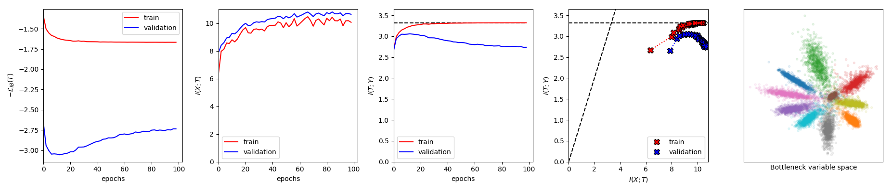
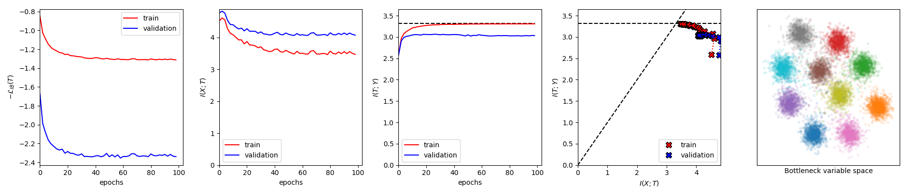
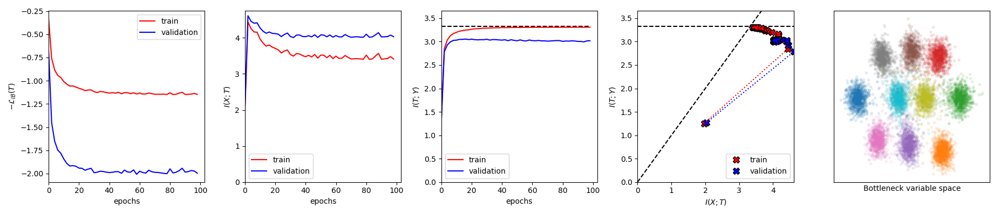

# Nonlinear Information Bottleneck (PyTorch)

Implementation of ["Nonlinear Information Bottleneck"](https://arxiv.org/pdf/1705.02436.pdf), Kolchinsky et al. in PyTorch. After talking with Dr. Kolchinsky, Dr. Tracey and Prof. Wolpert, only one estimation of the KDE variance is done per epoch.

## Examples

### beta = 0 without training sigma



### beta = 0.2 without training sigma



### beta = 0.3 training sigma



## Requirements
- Pytorch 1.0.1
- autograd 1.2
- scipy 1.2.1
- matplotlib 3.0.3
- progressbar 3.39.3

## Usage

```console
run.py [-h] [--logs_dir LOGS_DIR] [--figs_dir FIGS_DIR]
              [--models_dir MODELS_DIR] [--n_epochs N_EPOCHS] [--beta BETA]
              [--K K] [--logvar_kde LOGVAR_KDE] [--logvar_t LOGVAR_T]
              [--sgd_batch_size SGD_BATCH_SIZE]
              [--mi_batch_size MI_BATCH_SIZE] [--same_batch]
              [--optimizer {sgd,rmsprop,adadelta,adagrad,adam,asgd,sparseadam}]
              [--learning_rate LEARNING_RATE]
              [--learning_rate_drop LEARNING_RATE_DROP]
              [--learning_rate_steps LEARNING_RATE_STEPS] [--train_logvar_t]
              [--eval_rate EVAL_RATE] [--visualize] [--verbose]
              
Run non-linear IB on MNIST dataset (with Pytorch)

optional arguments:
  -h, --help            show this help message and exit
  --logs_dir LOGS_DIR   folder to output the logs (default: ../results/logs/)
  --figs_dir FIGS_DIR   folder to output the images (default:
                        ../results/figures/)
  --models_dir MODELS_DIR
                        folder to save the models (default:
                        ../results/models/)
  --n_epochs N_EPOCHS   number of training epochs (default: 100)
  --beta BETA           Lagrange multiplier (default: 0.0)
  --K K                 Dimensionality of the bottleneck varaible (default: 2)
  --logvar_kde LOGVAR_KDE
                        initial log variance of the KDE estimator (default:
                        -1.0)
  --logvar_t LOGVAR_T   initial log varaince of the bottleneck variable
                        (default: -1.0)
  --sgd_batch_size SGD_BATCH_SIZE
                        mini-batch size for the SGD on the error (default:
                        128)
  --mi_batch_size MI_BATCH_SIZE
                        mini-batch size for the I(X;T) estimation (default:
                        1000)
  --same_batch          use the same mini-batch for the SGD on the error and
                        I(X;T) estimation (default: False)
  --optimizer {sgd,rmsprop,adadelta,adagrad,adam,asgd,sparseadam}
                        optimizer (default: adam)
  --learning_rate LEARNING_RATE
                        initial learning rate (default: 0.0001)
  --learning_rate_drop LEARNING_RATE_DROP
                        learning rate decay rate (step LR every
                        learning_rate_steps) (default: 0.6)
  --learning_rate_steps LEARNING_RATE_STEPS
                        number of steps (epochs) before decaying the learning
                        rate (default: 10)
  --train_logvar_t      train the log(variance) of the bottleneck variable
                        (default: False)
  --eval_rate EVAL_RATE
                        evaluate I(X;T), I(T;Y) and accuracies every eval_rate
                        epochs (default: 20)
  --visualize           visualize the results every eval_rate epochs (default:
                        False)
  --verbose             report the results every eval_rate epochs (default:
                        False)

```

