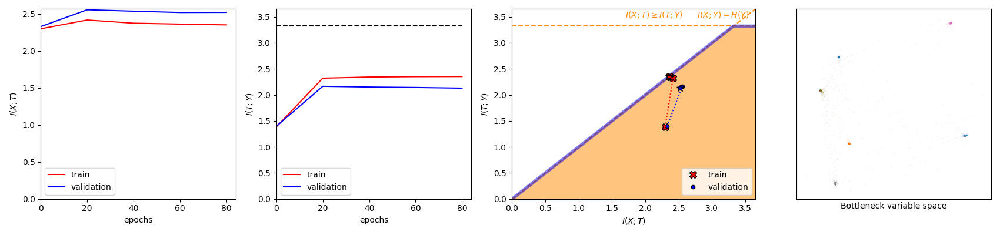
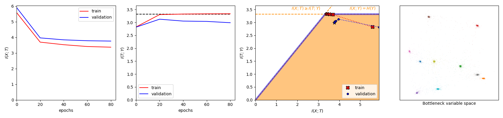
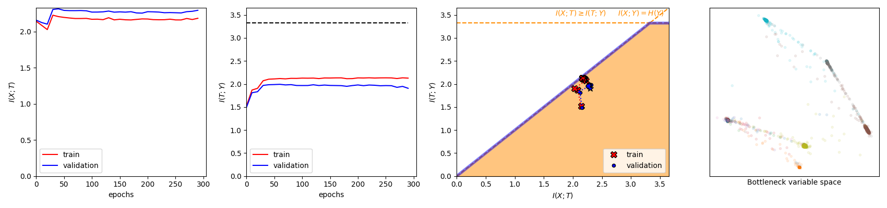
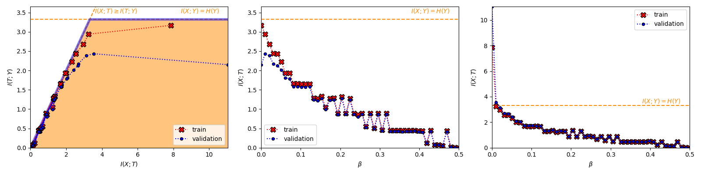
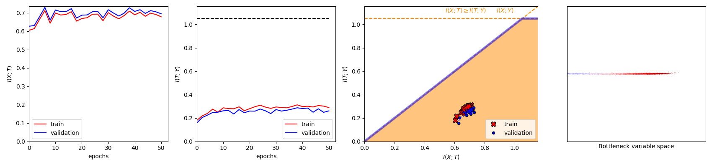
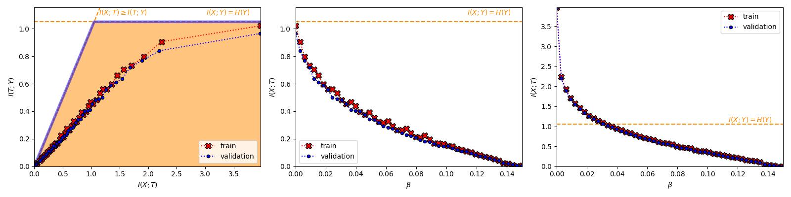

# Nonlinear Information Bottleneck (PyTorch)

Implementation of ["Nonlinear Information Bottleneck, 2019"](https://arxiv.org/abs/1705.02436), from Artemy Kolchinsky, Brendan D. Tracey and David H. Wolpert in PyTorch. For a tensorflow implementation, please go to ["Artemy Kolchinsky's github"](https://github.com/artemyk/nonlinearIB).

This repository contains the updated implementation from 2019. To see the original implementation, please go to the `master-old` branch. The highlights of the new version of the Nonlinear-IB are:
- Consideration of the empirical distribution of the training data instead of a MoG. This frees us from the optimization of the covariances of those matrices.
- Usage of the same batch for both MI estimation and SGD training. This frees memory usage and results in a faster flow of the gradients in the network.
- Possibility of using the Nonlinear-IB for regression. Here we assume H(Y) is the entropy of a Gaussian with variance var(Y) and H(Y|T) is the entropy of a Gaussian with variance the MSE between Y and our estimations.
- Allow the usage of the power and exponential IB Lagrangians to explore the IB curve from ["The Convex Information Bottleneck Lagrangian"](https://arxiv.org/abs/1911.11000). We can use the the squared IB Lagrangian from ["Caveats for information bottleneck in deterministic scenarios, ICLR 2019"](https://openreview.net/pdf?id=rke4HiAcY7) as in the Nonlinear-IB article by using the power IB Lagrangian with parameter equal to 1.

## Examples

### On MNIST

#### Exponential IB Lagrangian with parameter = 1. Beta = 0.05



#### Normal IB Lagrangian. Beta = 0.15



### On Fashion MNIST

#### Power IB Lagrangian with parameter = 1 (or squared IB Lagrangian). Beta = 0.1



#### Behavior of the Exponential IB Lagrangian with parameter = 1.



### On California Housing 

#### Exponential IB Lagrangian with parameter 3. Beta = 0.005



#### Behavior of the Exponential IB Lagrangian with parameter 1.




## Requirements

The code has been tested on Python 3.6.8 and the following packages. It will probably work with older packages, though.

- torch 1.2.0+cpu
- torchvision 0.4.0+cpu
- matplotlib 3.1.1
- progressbar2 3.43.1
- scikit-learn 0.21.3
- numpy 1.17.2

In order to install the requirements you can just write ```pip3 install -r requirements.txt```.

## Usage

Run either ```python3 train_model.py```or ```python3 study_behavior.py``` in the `src` directory. The arguments are the following:

```console
[-h] [--logs_dir LOGS_DIR] [--figs_dir FIGS_DIR]
    [--models_dir MODELS_DIR] [--n_epochs N_EPOCHS]
    [--beta BETA] [--beta_lim_min BETA_LIM_MIN]
    [--beta_lim_max BETA_LIM_MAX] [--hfunc {exp,pow,none}]
    [--hfunc_param HFUNC_PARAM] [--n_betas N_BETAS] [--K K]
    [--logvar_t LOGVAR_T] [--sgd_batch_size SGD_BATCH_SIZE]
    [--early_stopping_lim EARLY_STOPPING_LIM]
    [--dataset {mnist,fashion_mnist,california_housing}]
    [--optimizer_name {sgd,rmsprop,adadelta,adagrad,adam,asgd}]
    [--learning_rate LEARNING_RATE]
    [--learning_rate_drop LEARNING_RATE_DROP]
    [--learning_rate_steps LEARNING_RATE_STEPS]
    [--train_logvar_t] [--eval_rate EVAL_RATE] [--visualize]
    [--verbose]

Run nonlinear IB (with Pytorch)

optional arguments:
  -h, --help            show this help message and exit
  --logs_dir LOGS_DIR   folder to output the logs (default: ../results/logs/)
  --figs_dir FIGS_DIR   folder to output the images (default:
                        ../results/figures/)
  --models_dir MODELS_DIR
                        folder to save the models (default:
                        ../results/models/)
  --n_epochs N_EPOCHS   number of training epochs (default: 100)
  --beta BETA           Lagrange multiplier (only for train_model) (default:
                        0.0)
  --beta_lim_min BETA_LIM_MIN
                        minimum value of beta for the study of the behavior
                        (default: 0.0)
  --beta_lim_max BETA_LIM_MAX
                        maximum value of beta for the study of the behavior
                        (default: 1.0)
  --hfunc {exp,pow,none}
                        Monotonically increasing, strictly convex function for
                        the Lagrangian (default: exp)
  --hfunc_param HFUNC_PARAM
                        Parameter of the h function (default: 1.0)
  --n_betas N_BETAS     Number of Lagrange multipliers (only for study
                        behavior) (default: 21)
  --K K                 Dimensionality of the bottleneck varaible (default: 2)
  --logvar_t LOGVAR_T   initial log varaince of the bottleneck variable
                        (default: 0.0)
  --sgd_batch_size SGD_BATCH_SIZE
                        mini-batch size for the SGD on the error (default:
                        256)
  --early_stopping_lim EARLY_STOPPING_LIM
                        early stopping limit for non improvement (default: 20)
  --dataset {mnist,fashion_mnist,california_housing}
                        dataset where to run the experiments. Classification:
                        MNIST or Fashion MNIST. Regression: California
                        housing. (default: mnist)
  --optimizer_name {sgd,rmsprop,adadelta,adagrad,adam,asgd}
                        optimizer (default: adam)
  --learning_rate LEARNING_RATE
                        initial learning rate (default: 0.001)
  --learning_rate_drop LEARNING_RATE_DROP
                        learning rate decay rate (step LR every
                        learning_rate_steps) (default: 0.6)
  --learning_rate_steps LEARNING_RATE_STEPS
                        number of steps (epochs) before decaying the learning
                        rate (default: 10)
  --train_logvar_t      train the log(variance) of the bottleneck variable
                        (default: False)
  --eval_rate EVAL_RATE
                        evaluate I(X;T), I(T;Y) and accuracies every eval_rate
                        epochs (default: 20)
  --visualize           visualize the results every eval_rate epochs (default:
                        False)
  --verbose             report the results every eval_rate epochs (default:
                        False)
```
